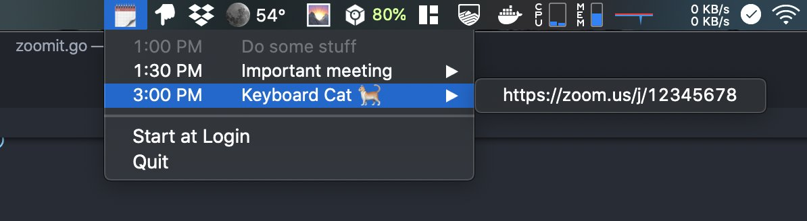

# LaZ Click

_la·zy_ **|** _/ˈlāzē/ - unwilling to work or use energy._

_LaZ Click - The act of saving yourself from the process of "alt-tab to browser –> find calendar tab –> open meeting –> click zoom link –> click 'open zoom button' –> die inside"_

A simple menubar app that lists upcoming meetings and allows you to open Zoom with ease. 🤝 📹

## Overview

- Launch the app
- Grant access to your Google Calendar
- Zoom away 💨

## Status

🔥 Under active development 🔥

> Prerelease available now: [LaZ.zip](https://github.com/dacort/zoomit/releases)
> _Only compatible with macOS Catalina_

It will sync with Google Calendar every minute and if any of your meeting locations match "zoom.us/j/<ZOOM_ID>", you'll be able to expand that entry and click on the Zoom link!

Shows your next 10 meetings.

## Known Issues

- [x] Crashes the first time you authenticate
- [x] Crashes if you click on the icon before the calendar syncs
- [x] Formatting needs some prettification on the menu
- [ ] Needs a proper downloadable app and Google app
- [ ] App must be validated: https://support.google.com/cloud/answer/7454865

## Features to add

- [x] Show dates/days in addition to times
- [ ] Option to just open Zoom for you...why wait! (ala [@ConnorPM](https://twitter.com/ConnorPM/status/1250473781707132928?s=20))

## References

https://github.com/golang/oauth2/blob/master/google/example_test.go
https://github.com/golang/go/blob/1abf3aa55bb8b346bb1575ac8db5022f215df65a/src/net/http/server.go#L2783
https://developers.google.com/calendar/quickstart/go
https://martinfowler.com/articles/command-line-google.html
https://developers.google.com/identity/protocols/oauth2/native-app#custom-uri-scheme